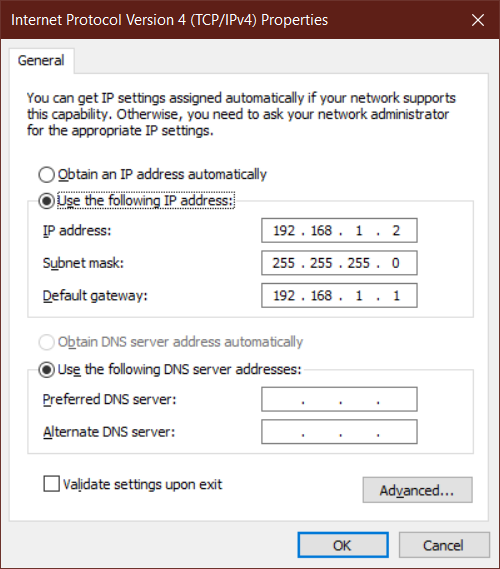

## Static fallback IP

There are 2 use cases:

1. Connecting to the STM32H745 through a router
2. Directly connecting to STM32H745

In scenario 1, assigning IP is done using DHCP. Scenario 2 uses a static fallback IP. 

### Implementation
The implementation builds on [`dhcp_nocable.md`](dhcp_nocable.md).


```c
#define LWIP_NETIF_API 1
```

```c
#include "lwip/netifapi.h"

static void ethernet_link_status_updated(struct netif *netif) 
{
	if (netif_is_up(netif))
	{
	/* USER CODE BEGIN 5 */

		// Do we have an IP?
		if(netif->ip_addr.addr != 0)
		{
			return;
		}

		// if not, let's check again after 2 seconds
		osDelay(2000);

		// Do we have an IP?
		if(netif->ip_addr.addr != 0)
		{
			return;
		}
		
		// no IP? Restart DHCP client
		dhcp_release(netif);
		dhcp_stop(netif);
		osDelay(1000);
		dhcp_start(netif);
		osDelay(2000);

		// Did DHCP work this time?
		if(netif->ip_addr.addr != 0)
		{
			return;
		}

		// if not; stop DHCP
		// use netifapi_dhcp_release_and_stop in v2.1+
		netifapi_dhcp_release(netif); // dhcp_release(netif); 
		netifapi_dhcp_stop(netif); // dhcp_stop(netif);
		osDelay(1000);
		netif_set_down(netif);
		osDelay(2000);


		// set static IP address
		IP4_ADDR(&ipaddr, 192, 168, 1, 3);
		IP4_ADDR(&netmask, 255, 255, 255, 0);
		IP4_ADDR(&gw, 192, 168, 1, 1);

		netif_set_addr(&gnetif, &ipaddr, &netmask, &gw);


	/* USER CODE END 5 */
	}
	else /* netif is down */
	{  
	/* USER CODE BEGIN 6 */

		// ethernet cable disconnected

	/* USER CODE END 6 */
	} 
}
```

### Requirements
In order for scenario 2 to work, a static IP is required on the laptop/PC. To do this, enter the settings below. More information here https://www.howtogeek.com/howto/19249/how-to-assign-a-static-ip-address-in-xp-vista-or-windows-7/

