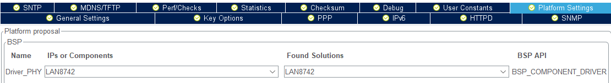
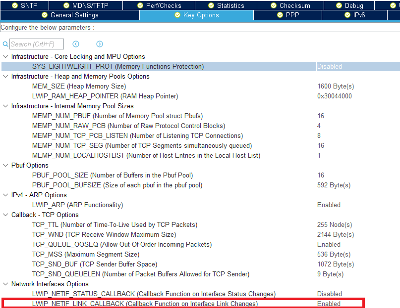

## LWIP without FreeRTOS

---

References:
* [LwIP_HTTP_Server_Netconn_RTOS](https://github.com/STMicroelectronics/STM32CubeH7/tree/master/Projects/NUCLEO-H743ZI/Applications/LwIP/LwIP_HTTP_Server_Netconn_RTOS)
* [How to create project for STM32H7 with Ethernet and LwIP stack working](https://community.st.com/s/article/How-to-create-project-for-STM32H7-with-Ethernet-and-LwIP-stack-working)
* [HowardWhile / 2020_note](https://translate.google.com/translate?sl=zh-CN&tl=en&u=https%3A%2F%2Fgithub.com%2FHowardWhile%2F2020_note%2Fwiki%2FSTM32)

---

These settings are based on the linked references, so take them with a grain of salt. 

1. Enable the M7 D-Cache (and optionally the L-Cache)
2. Enable the MPU and add the 2 regions as depiced below


3. Enable LWIP (for the M7)
4. Select a PHY driver (LAN8742 for the Nucleo)


5. Optionally enable LWIP_NETIF_LINK_CALLBACK


6. Modify the [STM32H745ZITX_FLASH.ld](../CM7/STM32H745ZITX_FLASH.ld) linker script
	* set `_estack _estack = 0x24080000`	
	* set memory areas
	* replace `RAM` with `RAM_D1`
	* add `.lwip_sec`

```c
/* Specify the memory areas */
MEMORY
{
FLASH (rx)		: ORIGIN = 0x08000000, LENGTH = 1024K
DTCMRAM (xrw)	: ORIGIN = 0x20000000, LENGTH = 128K
RAM_D1 (xrw)	: ORIGIN = 0x24000000, LENGTH = 512K
RAM1_D2 (xrw)	: ORIGIN = 0x30000000, LENGTH = 128K
RAM2_D2 (xrw)	: ORIGIN = 0x30020000, LENGTH = 128K
RAM3_D2 (xrw)	: ORIGIN = 0x30040000, LENGTH = 32K
RAM4_D3 (xrw)	: ORIGIN = 0x38000000, LENGTH = 64K
ITCMRAM (xrw)	: ORIGIN = 0x00000000, LENGTH = 64K
}
```
```c
  .lwip_sec (NOLOAD) : {
    . = ABSOLUTE(0x30040000);
    *(.RxDecripSection) 
    
    . = ABSOLUTE(0x30040060);
    *(.TxDecripSection)
    
    . = ABSOLUTE(0x30040200);
    *(.RxArraySection) 
  } >RAM3_D2 AT> FLASH
```

7. Add `SCB_CleanInvalidateDCache();` in M7's [main.c](../CM7/Core/Src/main.c)
```c
  /* USER CODE BEGIN 2 */

  SCB_CleanInvalidateDCache();

  /* USER CODE END 2 */
```

8. Add `MX_LWIP_Process ();` to the infinite while loop in M7's [main.c](../CM7/Core/Src/main.c)

```c
  /* Infinite loop */
  /* USER CODE BEGIN WHILE */
  while (1)
  {
    /* USER CODE END WHILE */

    /* USER CODE BEGIN 3 */
	  MX_LWIP_Process ();
  }
  /* USER CODE END 3 */
```

9. Build and compile. There *should* now be a new IP listed on the network (using DHCP)
