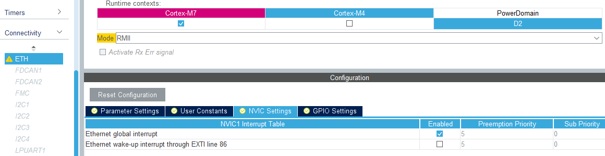

## LWIP with RTOS

Follow steps 1-9 listed in above in [LWIP without FreeRTOS](lwip_nortos.md). Continue with the steps listed below.

10. Select CMSIS_V1 in FreeRTOS_M7 and increase the stack size to 256 words

11. Enable the *ETH* global interupt

12. Build and compile. There *should* once again be a new IP listed on the network (using DHCP)