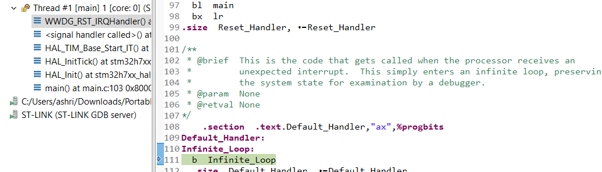

## Issue: SysTick not counting
For some reason the SysTick counter is not automatically added. This causes either infinit wait loops when calling HAL_Delay (and related function), or causes startup error (see image below)



To fix this, either add this piece of code:

```c
/**
  * @brief This function handles System tick timer.
  */
void SysTick_Handler(void)
{
  /* USER CODE BEGIN SysTick_IRQn 0 */

  /* USER CODE END SysTick_IRQn 0 */
  HAL_IncTick();
  /* USER CODE BEGIN SysTick_IRQn 1 */

  /* USER CODE END SysTick_IRQn 1 */
}
```

Or enable SysTick generation:


**Note**: If the SysTick checkbox is greyed out, try selecting another TIM. TIM1, TIM2 and TIM3 usually work.