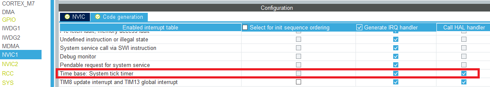

# STM32H745_Ethernet

Trying to get a working Ethernet connection on the STM32H745. Testing on the NUCLEO-H745ZI-Q using FW_1.7 and the STM32CubeIDE.

Using the following references:
* [LwIP_HTTP_Server_Netconn_RTOS](https://github.com/STMicroelectronics/STM32CubeH7/tree/master/Projects/NUCLEO-H743ZI/Applications/LwIP/LwIP_HTTP_Server_Netconn_RTOS)
* [How to create project for STM32H7 with Ethernet and LwIP stack working](https://community.st.com/s/article/How-to-create-project-for-STM32H7-with-Ethernet-and-LwIP-stack-working)
* [HowardWhile / 2020_note](https://translate.google.com/translate?sl=zh-CN&tl=en&u=https%3A%2F%2Fgithub.com%2FHowardWhile%2F2020_note%2Fwiki%2FSTM32)

---

## First issue: SysTick not counting
For some reason the SysTick counter is not automatically added. This causes either infinit wait loops when calling HAL_Delay (or related function), or causes startup error (see image below)


To fix this, either add this piece of code:

```c
/**
  * @brief This function handles System tick timer.
  */
void SysTick_Handler(void)
{
  /* USER CODE BEGIN SysTick_IRQn 0 */

  /* USER CODE END SysTick_IRQn 0 */
  HAL_IncTick();
  /* USER CODE BEGIN SysTick_IRQn 1 */

  /* USER CODE END SysTick_IRQn 1 */
}
```

Or enable SysTick generation:


---